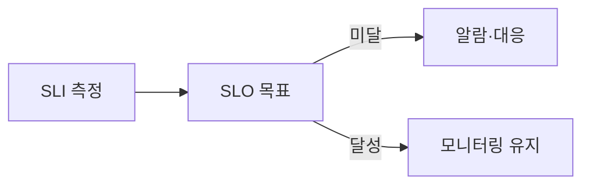

# SLI / SLO 개념

**SLI**(측정 지표) → **SLO**(목표값) → 미달 시 알람·대응.

서비스 품질을 측정하고 목표를 두는 지표입니다.

## SLI (Service Level Indicator)

- **측정 지표**: “무엇을, 어떻게 측정할지” 정의
- 예: 가용성(정상 응답 비율), 지연 시간(p50/p99), 에러율

## SLO (Service Level Objective)

- **목표값**: SLI에 대한 목표 (예: 가용성 99.9%, p99 지연 200ms 이하)
- SLO 미달 시 **알람·대응**, 고객에게 수준을 약속했으면 **SLA**와 연계

## SLA (Service Level Agreement)

- **고객과의 계약**: “이 수준을 보장한다”는 **약속** + 미달 시 **보상**(크레딧, 위약금 등) 조건
- SLO는 내부 목표, SLA는 고객·계약서에 쓰는 보장. SLA에 넣을 수치를 SLO로 세워서 운영·알람에 씀

## 관계

- **SLI**로 실제 값을 측정 → **SLO**로 목표 설정 → 미달 시 **알람·개선**

## 실제 예시

| SLI | SLO 예시 |
|-----|----------|
| 가용성 | 99.9% (월 43분 이하 다운 허용) |
| 지연 시간 | p99 200ms 이하 |
| 에러율 | 0.1% 이하 |

## 요약

| 구분 | SLI | SLO | SLA |
|------|-----|-----|-----|
| 의미 | 측정 지표 | 목표 수준(내부) | 고객과의 보장·계약 |
| 예 | 에러율 측정 | 에러율 0.1% 이하 | 미달 시 크레딧 등 |
