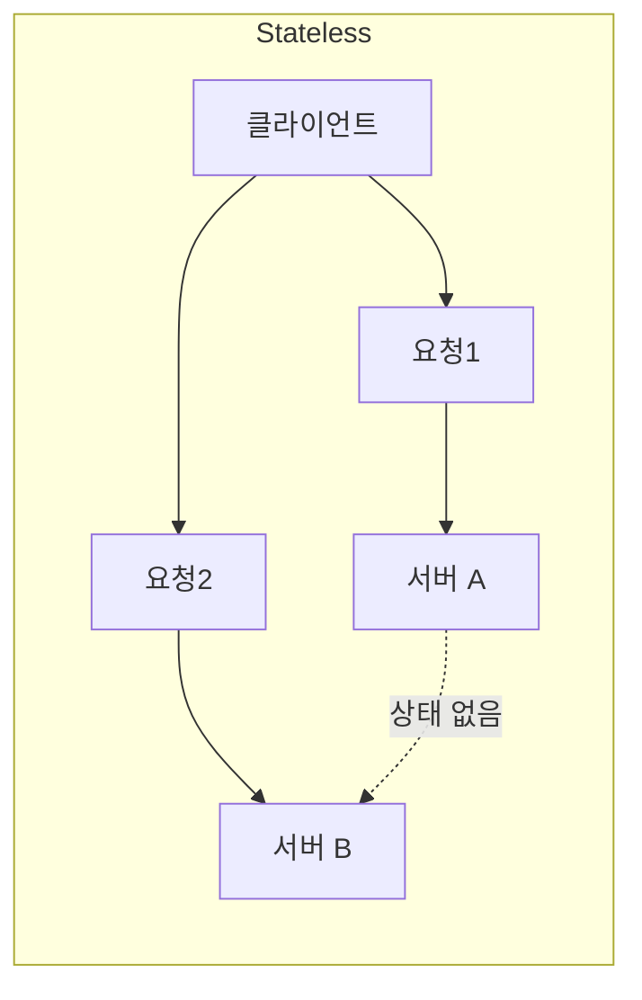
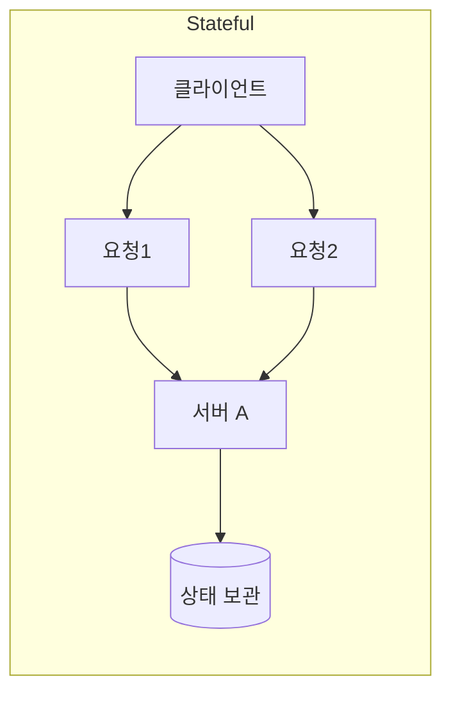

# Stateless vs Stateful

**Stateless**: 요청1 → 서버 A, 요청2 → 서버 B 가능. 서버는 이전 요청을 기억하지 않음.  
**Stateful**: 같은 클라이언트는 같은 서버로 가야 함(세션 등).

서버가 **요청 간 상태를 갖는지**만 구분합니다.

## Stateless (무상태)

- 요청마다 **독립**: 이전 요청 정보를 서버가 보관하지 않음
- 세션·로그인 상태는 클라이언트(쿠키·토큰)나 별도 저장소에 둠
- 수평 확장에 유리: 아무 인스턴스나 처리 가능

## Stateful (상태 유지)

- 서버가 **요청 간 상태**를 가짐 (세션, 메모리 등)
- 같은 클라이언트는 같은 서버로 가야 할 수 있음(스티키)
- 확장·장애 시 상태 이전·공유가 과제

## 개념 도식

- **Stateless**: 요청1→서버A, 요청2→서버B 가능. 서버는 이전 요청을 기억하지 않음.
- **Stateful**: 요청1·요청2 모두 **같은 서버**로 가야 상태(세션 등)를 쓸 수 있음.

## 실제 예시

| 구분 | 예시 | 이유 |
|------|------|------|
| Stateless | 날씨 API, 검색 API | "오늘 날씨 알려줘"만 보내면 됨. 서버는 누가 물었는지·이전 검색을 기억할 필요 없음. |
| Stateful | 쇼핑 카트(서버 메모리), 터미널 SSH 세션 | 카트에 담은 내용·로그인 세션이 **그 서버 메모리**에 있어서, 다음 요청도 같은 서버로 가야 함. |

## 요약

| 구분 | Stateless | Stateful |
|------|-----------|----------|
| 서버 상태 | 없음 | 있음 |
| 확장 | 쉬움 | 주의 필요 |
