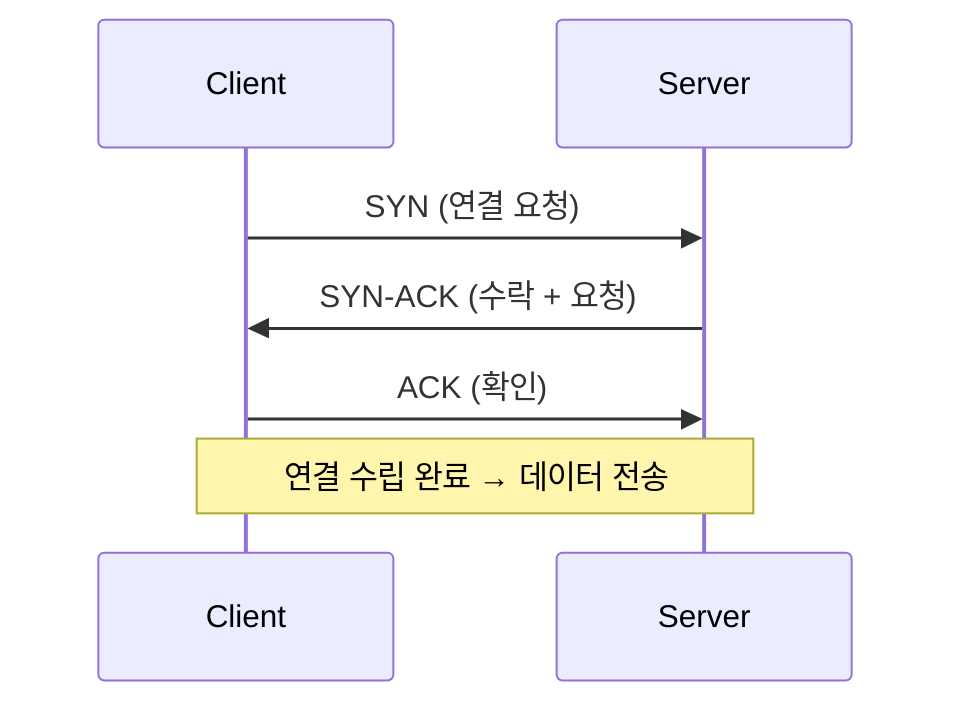
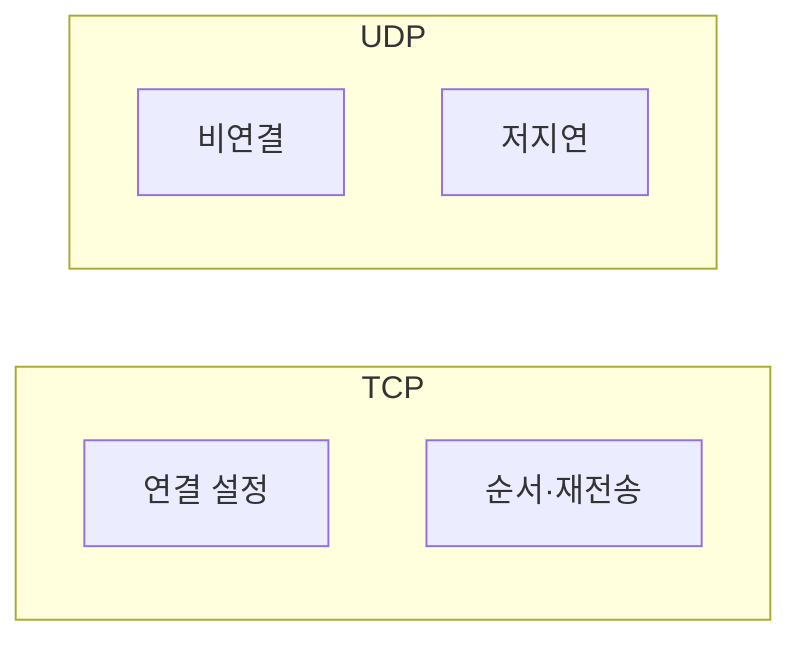

# TCP vs UDP

전송 계층에서 **연결 방식**과 **신뢰성** 차이만 정리합니다.

## TCP (Transmission Control Protocol)

- **연결 지향**: 통신 전에 연결 설정(핸드셰이크)
- **신뢰성**: 순서 보장, 재전송, 흐름 제어
- 용도: HTTP, HTTPS, SSH 등 “빠뜨리면 안 되는” 트래픽

### 3-way handshake (연결 설정)

TCP는 **SYN → SYN-ACK → ACK** 세 단계로 연결을 맺습니다.

## UDP (User Datagram Protocol)

- **비연결**: 연결 설정 없이 패킷 전송
- **신뢰성 없음**: 순서·재전송 보장 안 함, 오버헤드 작음
- 용도: DNS 쿼리, 실시간 스트리밍, VoIP 등

## 비교 요약

| 구분 | TCP | UDP |
|------|-----|-----|
| 연결 | 있음 | 없음 |
| 신뢰성 | 있음 | 없음 |
| 오버헤드 | 큼 | 작음 |
