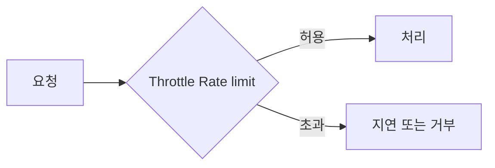
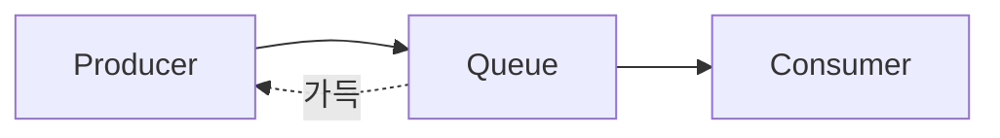

# Throttling / Rate limiting / Backpressure

**요청** → Throttle·Rate limit 확인 → 허용이면 처리, 초과면 지연·거부. **Backpressure**: 다운스트림이 바쁘면 업스트림 전송 완화.

과부하를 막고 서비스를 안정적으로 유지하기 위한 제어 방식입니다.

## 한눈에 비교

| 구분 | 의미 | 누가 제어하는가 |
|------|------|-----------------|
| **Throttling** | 처리량·동시성 **상한**. 초과 시 지연/거부 | 서버·게이트웨이가 요청을 제한 |
| **Rate limiting** | 단위 시간당 **요청 수** 상한 | 서버가 "초당 N건" 등으로 제한 |
| **Backpressure** | **다운스트림이 바쁠 때** 업스트림이 보내는 속도를 늦춤 | 수신 쪽이 "더 보내지 마" 신호 |

## Throttling (쓰로틀링)

- **처리량·동시성 상한**을 두어, 초과 요청을 지연시키거나 거부.
- 예: API 동시 호출 수, DB 연결 수, Lambda 동시 실행 수.

## Rate limiting (속도 제한)

- **단위 시간당 요청 수**에 상한을 두는 방식.
- 예: "분당 1000건", "초당 10건". DDoS 완화, 공정한 자원 분배.

## Backpressure (역압)

- **다운스트림이 바쁠 때** 업스트림이 전송을 늦추거나 멈추는 흐름 제어.
- 예: 큐가 가득 찼을 때 생산자를 블로킹.

## 개념 도식

Backpressure: 큐 가득 시 Producer가 보내는 속도를 늦춤.

