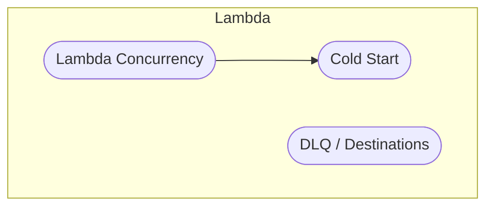
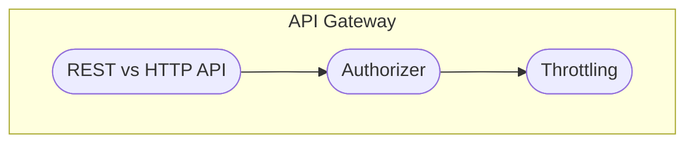
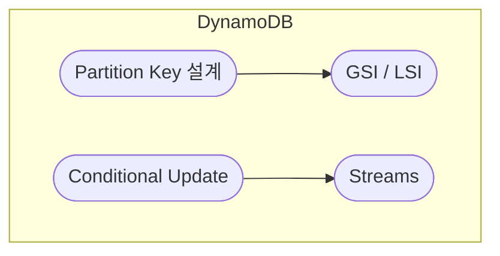
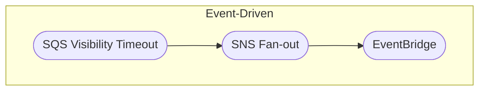
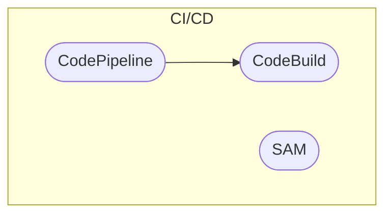

# 4. DVA (Developer) · 개요

실제 코드·서비스 동작 이해를 한눈에 볼 수 있습니다.  
노드를 클릭하면 해당 개념 문서로 이동합니다.

---

## Lambda 심화

---

## API Gateway

---

## DynamoDB 심화

---

## Event-Driven

---

## CI/CD

---

세부 설명은 각 개념 문서에서 이어서 읽을 수 있습니다.
