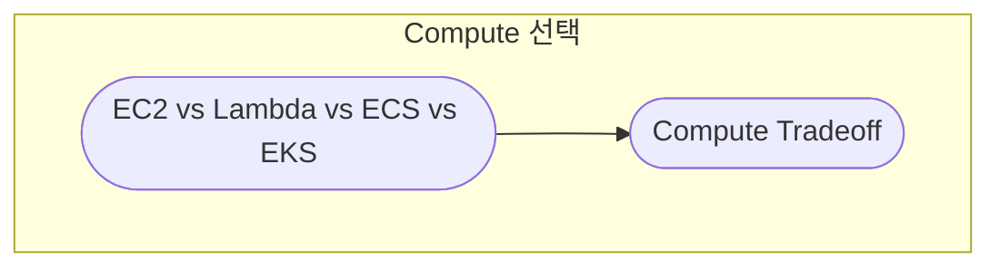
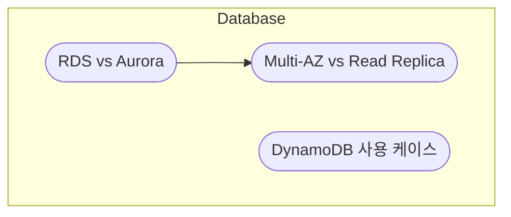
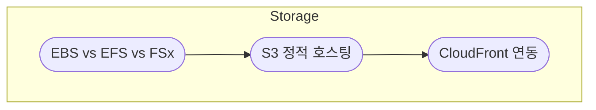
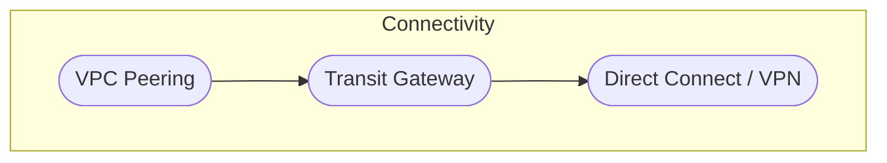
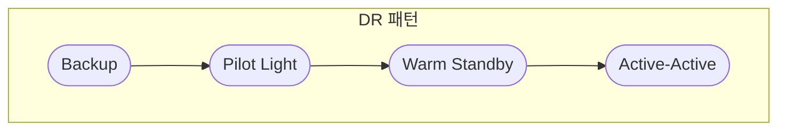

# 3. SAA (Architect) · 개요

요구사항 기반 아키텍처 설계를 한눈에 볼 수 있습니다.  
노드를 클릭하면 해당 개념 문서로 이동합니다.

---

## Compute 선택 프레임

---

## Database 선택

---

## Storage 설계

---

## Connectivity

---

## DR 패턴

---

세부 설명은 각 개념 문서에서 이어서 읽을 수 있습니다.
