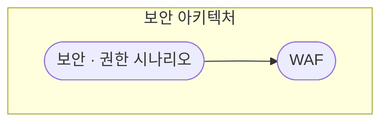
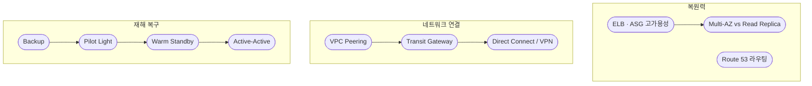
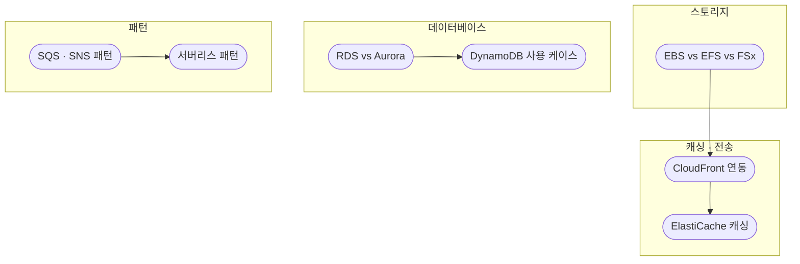
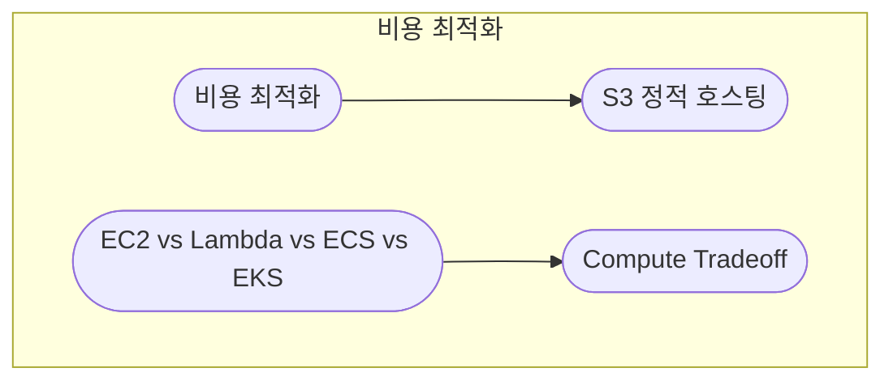

# 3. SAA (Solutions Architect) · 개요

**AWS Certified Solutions Architect - Associate (SAA-C03)** 시험은 2025년 기준, 클라우드 설계의 **4가지 주요 도메인**을 기반으로 하며, **실무 시나리오 기반** 문제가 다수를 이룹니다. 특히 **보안, 고가용성, 비용 최적화**가 핵심 빈출 주제입니다.  
아래 노드를 클릭하면 해당 개념 문서로 이동합니다.

---

## SAA-C03 시험 구조 (4개 도메인)

| 도메인 | 비중 | 핵심 주제 |
|--------|------|------------|
| **보안 아키텍처 설계** | 30% | IAM(Cross-account·Role·Policy), 데이터 암호화(KMS·SSE-KMS·SSE-S3·RDS), 네트워크 보안(Security Group·NACL·WAF) |
| **복원력 있는 아키텍처 설계** | 26% | ELB·ASG(트래픽 분산·탄력성), Multi-AZ·Read Replica·Aurora Global DB, Route 53(Geolocation·Latency·Weighted) |
| **고성능 아키텍처 설계** | 24% | EBS 타입·S3 성능, CloudFront·ElastiCache·DAX, DynamoDB·Aurora |
| **비용 최적화 아키텍처 설계** | 20% | S3 Lifecycle·Tiering(Intelligent-Tiering·Glacier), Spot·Reserved Instance·Savings Plans |

---

## 핵심 서비스 및 기술 (자주 나오는 시나리오)

- **Amazon S3**: 수명 주기 설정, 버킷 정책, 데이터 암호화
- **VPC**: Public/Private 서브넷, NAT Gateway, VPC Peering, Transit Gateway, PrivateLink
- **AWS Database**: RDS(MySQL/PostgreSQL), Aurora, DynamoDB
- **서버리스**: Lambda, API Gateway, SQS(Decoupling), SNS
- **Storage**: EFS(공유 파일 시스템), EBS, FSx

---

## 2025년 빈출 문제 유형 특징

- **복합 시나리오**: "최저 비용으로 높은 성능 + 보안 강화"처럼 2~3가지 요구사항을 동시에 만족하는 아키텍처 설계
- **실무 중심**: 특정 상황(예: "7일 후 거의 액세스하지 않는 데이터")에 가장 적합한 서비스 조합을 묻는 문제가 많음
- **마이그레이션**: 온프레미스 → AWS 이전(Snowball, DataSync, Direct Connect)

---

## 학습 팁

**AWS Well-Architected Framework** 백서를 참고하여 **보안, 신뢰성(복원력), 성능 효율성, 비용 최적화** 항목을 깊이 이해하는 것이 중요합니다. 시나리오에서 "최저 비용", "고가용성", "최소 운영 노력" 등의 조건을 파악해 적절한 AWS 서비스 조합을 선택하는 연습을 하세요.

---

## 1. 보안 아키텍처 설계 (30%)

IAM, 데이터 암호화, 네트워크 보안이 가장 높은 비중을 차지합니다.

- **IAM**: Cross-account access, Role 활용, Policy 제어(정책 평가·명시적 Deny)
- **데이터 암호화**: KMS를 이용한 S3·RDS 암호화(SSE-KMS, SSE-S3)
- **네트워크 보안**: Security Group(Stateful) vs NACL(Stateless), WAF

---

## 2. 복원력 있는 아키텍처 설계 (26%)

고가용성 및 장애 조치가 핵심입니다.

- **ELB & Auto Scaling**: ALB/NLB 트래픽 분산, ASG 탄력성
- **Multi-AZ 및 복제**: RDS Multi-AZ(재해 복구), Read Replica(성능), Aurora Global Database
- **Route 53**: Geolocation, Latency, Weighted 라우팅 정책
- **네트워크 연결**: VPC Peering, Transit Gateway, Direct Connect/VPN
- **재해 복구**: Backup, Pilot Light, Warm Standby, Active-Active

---

## 3. 고성능 아키텍처 설계 (24%)

스토리지·캐싱·DB 성능 최적화입니다.

- **스토리지 성능**: EBS 타입(IoPS 최적화), S3 성능
- **캐싱**: CloudFront(CDN), ElastiCache, DynamoDB Accelerator(DAX)
- **데이터베이스**: DynamoDB(Global Tables), Aurora
- **디커플링·서버리스**: SQS·SNS, Lambda·API Gateway 패턴

---

## 4. 비용 최적화 아키텍처 설계 (20%)

스토리지·컴퓨팅 비용 절감이 핵심입니다.

- **스토리지 비용**: S3 Lifecycle, Tiering(Intelligent-Tiering, Glacier)
- **컴퓨팅 비용**: Spot 인스턴스, Reserved Instance(RI), Savings Plans
- **서비스 선택**: 워크로드에 맞는 EC2 vs Lambda vs ECS vs EKS, 운영 부담 vs 확장성 vs 비용 트레이드오프

---

세부 설명은 각 개념 문서에서 이어서 읽을 수 있습니다.
