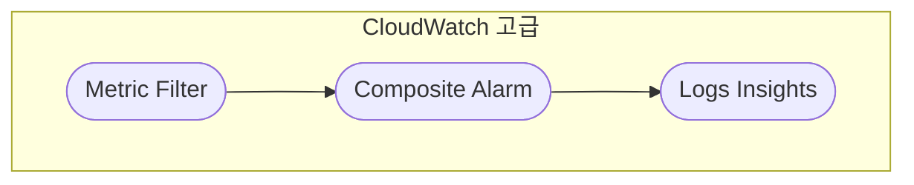
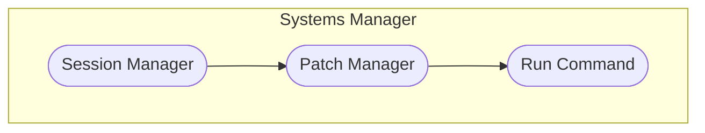
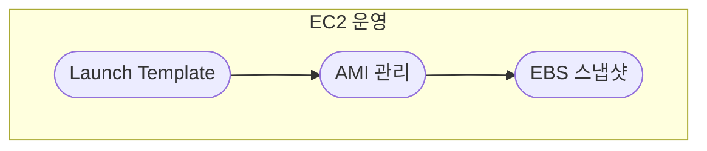
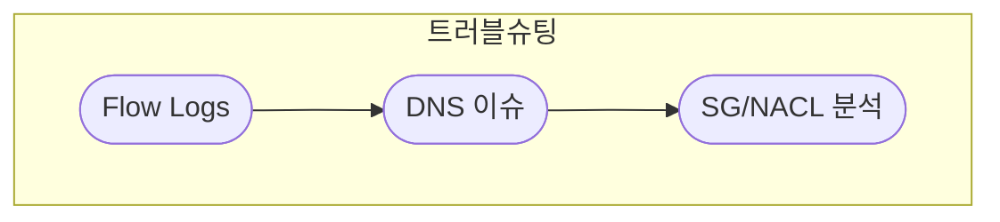
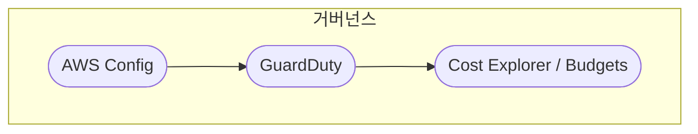

# 5. SOA (Operations) · 개요

운영·모니터링·자동화를 한눈에 볼 수 있습니다.  
노드를 클릭하면 해당 개념 문서로 이동합니다.

---

## CloudWatch 고급

---

## Systems Manager

---

## EC2 운영

---

## 트러블슈팅

---

## 거버넌스

---

세부 설명은 각 개념 문서에서 이어서 읽을 수 있습니다.
